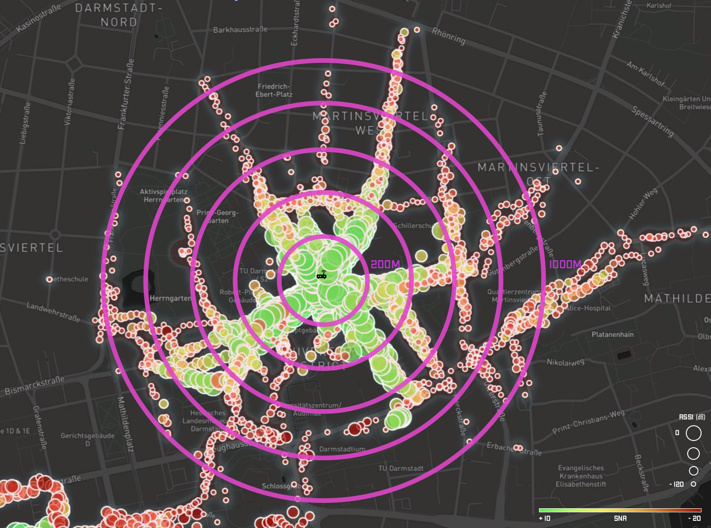
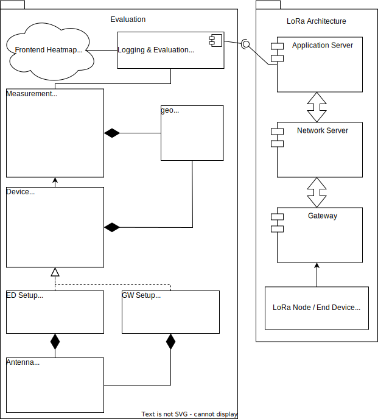
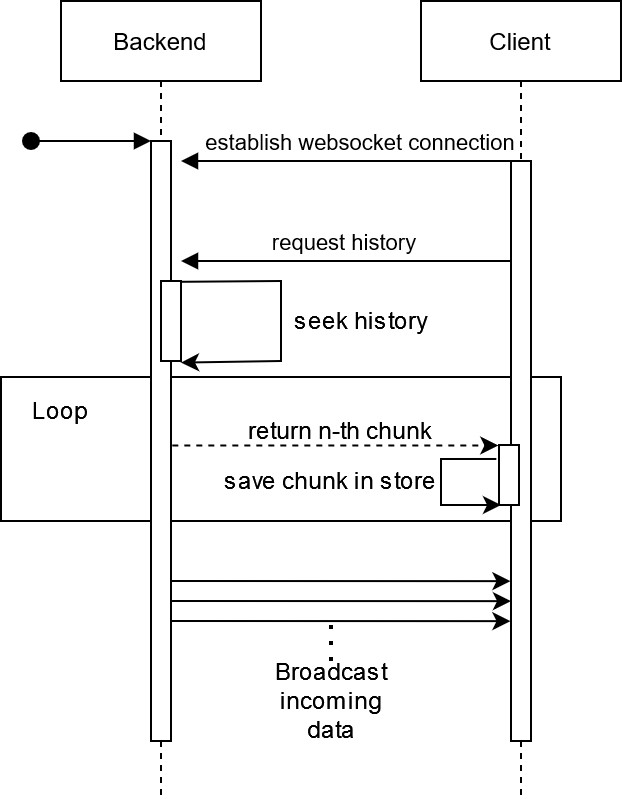
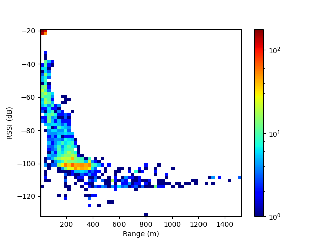

# **LoRaWAN Field Measurement & Real-Time Coverage Mapping**

### Large-Scale LoRaWAN Evaluation • 7,000+ Data Points • Real-Time Heatmaps • Custom Hardware Nodes

This project presents a complete, end-to-end **evaluation of LoRaWAN coverage in a real-world environment**, created as part of a research project at [**Secure Mobile Networking Lab (SEEMOO), TU Darmstadt**](https://www.seemoo.tu-darmstadt.de/).

We conducted a LoRaWAN field study in the region, collecting **over 7,000 geospatial measurement points** in Darmstadt, Germany.
To support real-time visibility and post-processing of these measurements, we built:

* 📡 **Custom LoRaWAN hardware nodes** with GPS tracking and **ChirpStack** backend
* 🖥️ **Data collection backend** for data ingestion & WebSocket broadcasting
* 🗺️ **Interactive heatmap frontend** for live coverage visualization
* 🧪 **Evaluation tools** for filtering, exporting, and analyzing coverage

This repository documents the architecture, workflow, and hardware setup.
It also links to the three main software components that make the system work.
Some of the work is proprietary and not available inside this repository. 

The full project documentation and analysis is available [Coverage of LoRa Gateways, Transcievers, Antennas in Darmstadt](doc/LoRa-coverage.pdf)

Watch the [LoRa Demo Video](https://youtu.be/3jSFXA11Auo)



---

## **📚 Table of Contents**

* [Overview](#overview)
* [System Architecture](#system-architecture)
* [Hardware Components](#hardware-components)
* [Software Architecture](#software-architecture)
* [Related Repositories](#related-repositories)
* [Features](#features)
* [Data Pipeline](#data-pipeline)
* [Field Test Summary](#field-test-summary)
* [Getting Started](#getting-started)
* [License](#license)


---
# **Overview**

LoRaWAN offers long-range, low-power communication — making it ideal for city-scale IoT deployments.
However, coverage varies significantly based on environment, gateway placement, spreading factor, antenna type, and node hardware.

### **Goals of this Project**

* Build a **real-time mapping system** for LoRaWAN measurements
* Evaluate **different hardware nodes** (Nucleo STM32, Feather M0)
* Compare **multiple antennas**, **spreading factors**, and deploying **three gateways**
* Enable reproducible LoRaWAN field tests with live visualization
* Provide exportable datasets for external GIS workflows


---
# **System Architecture**

The system is intentionally modular and lightweight, separating the hardware, backend, and visualization layers.

## **📡 High-Level Architecture**

```
┌──────────────────┐
│   LoRa Node(s)   │  →  GPS + LoRa packets
└────────┬─────────┘
         │
         ▼
┌──────────────────┐
│     Gateway      │  (WM1302 on Raspberry Pi)
└────────┬─────────┘
         │ MQTT / Semtech HAL
         ▼
┌──────────────────┐
│  Chirpstack NS   │  → LoRaWAN processing
└────────┬─────────┘
         │ HTTP Push
         ▼
┌──────────────────┐
│   Python Backend │  → WebSockets, Storage
└────────┬─────────┘
         │ Live updates
         ▼
┌──────────────────┐
│ React Frontend   │  → Real-time heatmaps
└──────────────────┘
```

## Detailed Architecture



# **Hardware Components**

### **Node A — STM32 Nucleo L152RE + SX1276 Shield**

* Semtech SX1276MB1MAS LoRa shield
* Waveshare L76X GPS module
* Optional long-range antenna (~20.5 cm)
* Runs **RIOT OS** (lora-gps-tracker)

### **Node B — Adafruit Feather M0 LoRa**

* Built-in SX1276
* Adafruit Ultimate GPS v3
* OLED display for debug
* Push-buttons for live SF switching
* RIOT OS stack

### **Gateways**

* Raspberry Pi 3
* WM1302 LoRa Concentrator
* 868 MHz antenna
* Runs Semtech HAL + Chirpstack Gateway Bridge

---

# **Software Architecture**

## **Backend (Python, AsyncIO)**

* Receives packets via **HTTP POST** from Chirpstack
* Stores records (CSV/JSON)
* Broadcasts live packets to all connected clients via **WebSockets**
* Serves measurement history on reconnect
* ZeroMQ and MQTT prototypes exist but the final design uses a pure async HTTP/WebSocket pipeline for simplicity




## **Frontend (React + MapboxGL)**

* Real-time LoRa measurement map
* Multi-criteria filtering:

  * Time, RSSI, SNR
  * Spreading factor
  * Gateways / Nodes
  * Altitude, distance zones
* Heatmap + point layer (size by RSSI, color by SNR)
* Live display of active nodes and distances
* Exports filtered data to **GeoJSON (RFC 7946)**

---

# **Data Pipeline**

```
Node → Gateway → Chirpstack → Backend → Browser

GPS + LoRa
   ↓
Semtech HAL (Raspberry Pi)
   ↓
Chirpstack Network Server
   ↓ HTTP Push
Python Backend (AsyncIO)
   ↓ WebSocket
React + MapboxGL UI
```

---

# **Field Test Summary**

We evaluated three gateway locations across Darmstadt:

* **Pankratiusstraße (CYSEC building)**
* **Mornewegstraße (University building)**
* **Adelungstraße (City apartment)**


### Key Findings

* **7500+ packets** collected
* SF12 significantly increases range, especially in open areas
* Feather M0 consistently outperformed the Nucleo node
* Longer antennas notably improved Nucleo performance
* Maximum stable distance achieved: **1.76 km** (SF12, Feather M0)
* Dense city structures severely limit signal behind buildings

Distribution of our measurements by signal strength, distance and packets.



The complete evaluation (with maps and zone tables) is included in the the [Documentation](doc/LoRa-coverage.pdf).

---

# **Getting Started**

## Clone the repo

```bash
git clone https://github.com/GigaDive/LoRaWAN-Field-Measurement-Darmstadt.git
```

## Start the frontend

```bash
cd dev/frontend
npm install
npm start
```
Don't forget to set the `MAPBOX_TOKEN` in the .env file. After starting you can click on `Load Demo Data`, view example data, play around with filter settings and download the filtered data as **GeoJSON**.

## Run the backend

```bash
cd dev/backend
python3 -m venv venv
source venv/bin/activate
pip install -r requirements.txt
python server.py
```

## Flash firmware

Instructions differ for STM32 and Feather M0. No further instructions provided here. 
The node needs to be able to send its current GPS location to the LoRa Gateway. The rest can be extracted from the auxiliary data from the [LoRa Network stack](https://www.chirpstack.io/docs/chirpstack-gateway-bridge/payloads/events.html). 


## Reminder

This repository is not a full guide on how to implement such a wireless measurement setup from the ground up; it is meant to provide examples and context to our execution of this task. Also, this cannot be understood as a full measurement of an entire city, but rather as a proof of concept that such architecture is feasible and can be used to measure real-world LoRa performance. We also recommend storing the data in a proper database and providing auxiliary metadata to properly classify a measurement run. For example, weather, ambient humidity, fog, and rain can influence the actual reception quality.

# **License**

MIT License 
